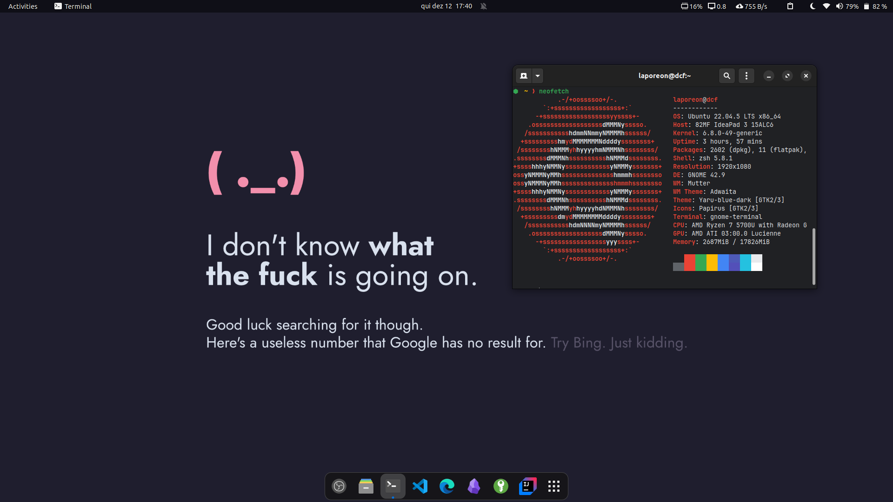

<h1 align="center">
  
  <p>Dotfiles</p>
</h1>

Here I keep some of my configuration files for both Windows and Linux.

To copy the content, I run the following script:

```sh
./copy.sh
```

## 🛠 Environment

I'm using Ubuntu with GNOME as my primary operational system.

- **Icons**: [Papirus](https://www.gnome-look.org/p/1166289)
- **Cursor**: [Bibata Modern Ice](https://www.gnome-look.org/p/1197198)
- **Terminal**: GNOME Terminal
- **Shell**: [zsh](https://ohmyz.sh/) + [oh-my-zsh](https://ohmyz.sh/) + [my custom theme](./linux/zsh/themes/dcf.zsh-theme)
- **GNOME Extensions**:
  - [Bluetooth Quick Connect](https://extensions.gnome.org/extension/1401/bluetooth-quick-connect/)
  - [Clipboard Indicator](https://extensions.gnome.org/extension/779/clipboard-indicator/)
  - [Sound Input & Output Device Chooser](https://extensions.gnome.org/extension/906/sound-output-device-chooser/)
  - [Sound percentage](https://extensions.gnome.org/extension/2120/sound-percentage/)
  - [Vitals](https://extensions.gnome.org/extension/1460/vitals/)
  - [WinTile](https://extensions.gnome.org/extension/1723/wintile-windows-10-window-tiling-for-gnome/)
  - [Transparent Top Bar](https://extensions.gnome.org/extension/3960/transparent-top-bar-adjustable-transparency/)

## 💻 Preview


