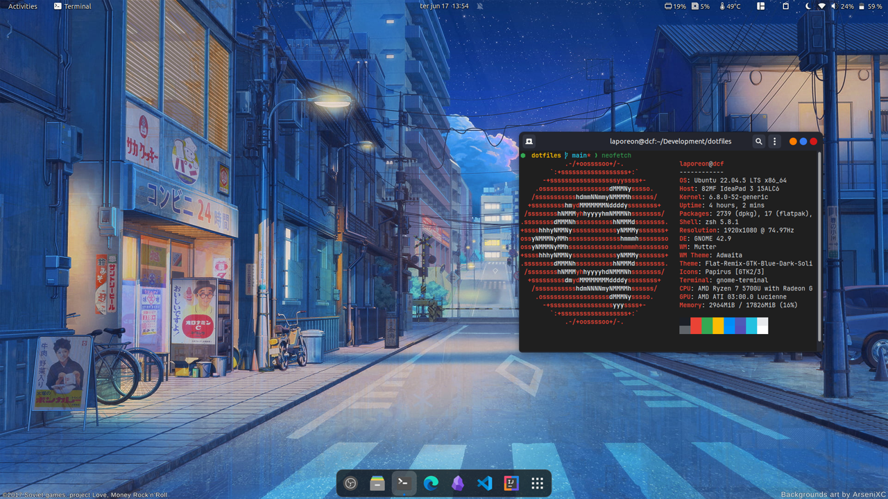

<h1 align="center">
   
  Dotfiles
</h1>

Here I store my configuration files for both Linux and Windows environments.

## 🛠 Environment

I'm using Ubuntu with GNOME as my primary operating system.

- **Icons**: [Papirus](https://www.gnome-look.org/p/1166289)
- **Cursor**: [Bibata Modern Ice](https://www.gnome-look.org/p/1197198)
- **Terminal**: [WezTerm](https://wezterm.org/)
- **Shell**: [zsh](https://www.zsh.org/) + [oh-my-zsh](https://ohmyz.sh/) + [my custom theme](./environments/linux/zsh/themes/dcf.zsh-theme)
- **GNOME Extensions**:
  - [Bluetooth Quick Connect](https://extensions.gnome.org/extension/1401/bluetooth-quick-connect/)
  - [Clipboard Indicator](https://extensions.gnome.org/extension/779/clipboard-indicator/)
  - [Sound Input & Output Device Chooser](https://extensions.gnome.org/extension/906/sound-output-device-chooser/)
  - [Sound percentage](https://extensions.gnome.org/extension/2120/sound-percentage/)
  - [Vitals](https://extensions.gnome.org/extension/1460/vitals/)
  - [Tiling Shell](https://extensions.gnome.org/extension/7065/tiling-shell/)
  - [Transparent Top Bar](https://extensions.gnome.org/extension/3960/transparent-top-bar-adjustable-transparency/)

## 💻 Preview

